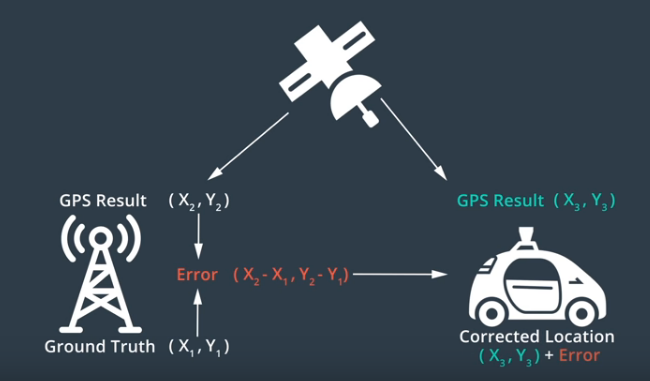
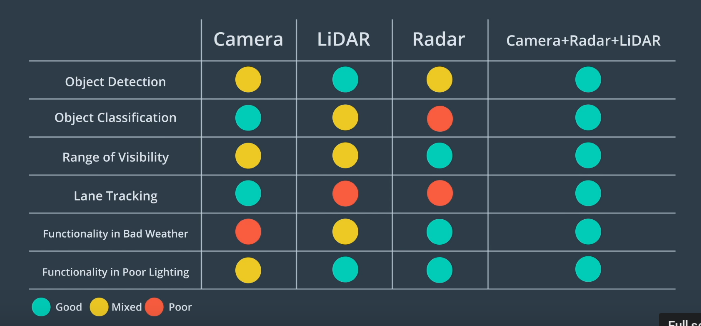
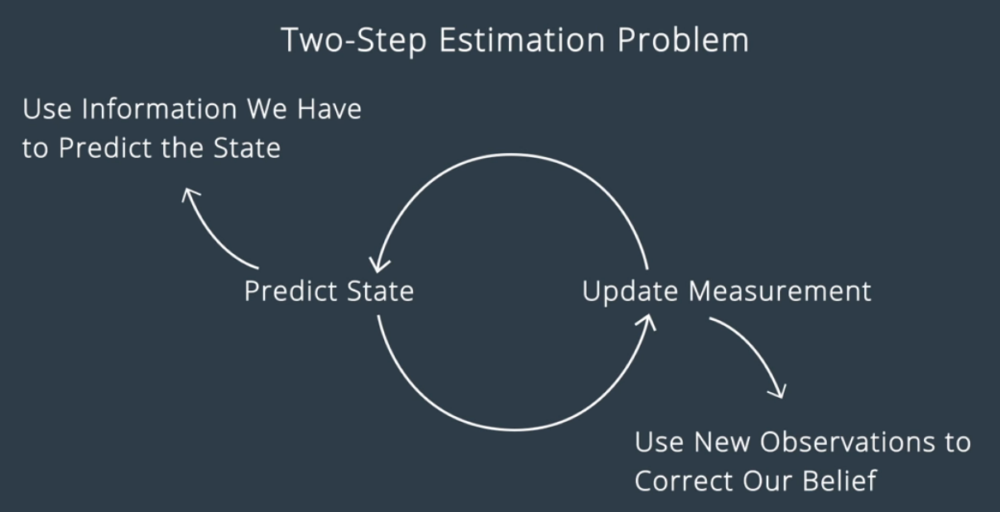
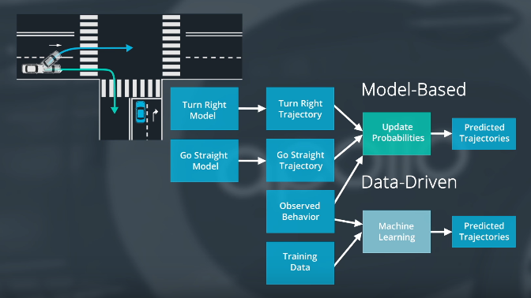
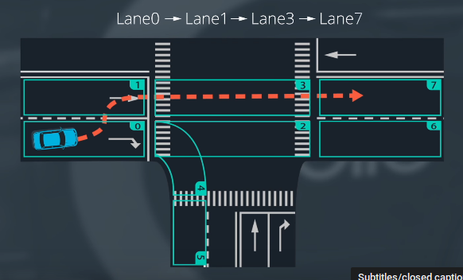
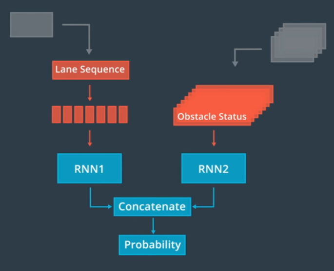
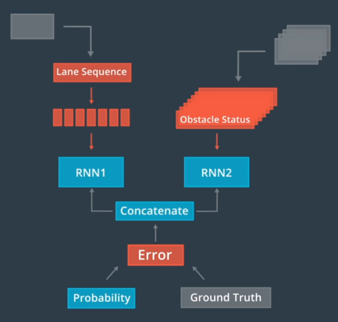

## Apollo Repository
You can find the popular self-driving car software Apollo on [Github](https://github.com/ApolloAuto/apollo)  

Apollo is organized by [modules](https://github.com/ApolloAuto/apollo/tree/master/modules). You can check this folder to preview what we will talk about in this course.

## Apollo 3.0
Baidu debuts Apollo 3.0 on July 4th! Start your exploration on Apollo 3.0 from [here](https://github.com/ApolloAuto/apollo/blob/master/docs/quickstart/apollo_3_0_quick_start.md).

## Apollo Structure

Apollo’s system centers around HD Maps and Localization. The other components of the system revolve around Perception, Prediction, Planning and Control, as we’ll see throughout this course.

## HD map
Click the [link of Apollo repo for map](https://github.com/ApolloAuto/apollo/tree/master/modules/map) to know more if you're interested.

### Road definitions from Apollo HD Maps  

<h3 id="standard-opendrive-vs-apollo-opendrive">Standard OpenDRIVE vs. Apollo OpenDRIVE</h3>
<table>
<thead>
<tr>
<th style="text-align:left">Main Difference</th>
<th style="text-align:left">Standard OpenDRIVE</th>
<th style="text-align:left">Apollo OpenDRIVE</th>
</tr>
</thead>
<tbody>
<tr>
<td style="text-align:left">Application Scenario</td>
<td style="text-align:left">Primarily used in simulation scenarios</td>
<td style="text-align:left">Primarily applied to real-world self-driving scenes</td>
</tr>
<tr>
<td style="text-align:left">Elemental Form Expression</td>
<td style="text-align:left">Describe lane shape using curve equations and offsets based on reference line</td>
<td style="text-align:left">Describe element shapes using absolute coordinate sequences</td>
</tr>
<tr>
<td style="text-align:left">Elemental Richness</td>
<td style="text-align:left">Provide common element types such as Road, Junction, Signal, and Object</td>
<td style="text-align:left">Refine element expression and enrich element attributes. Such as adding new no-parking areas, crosswalks, deceleration belts, stop lines, parking allowance signs, deceleration allowance signs, etc.</td>
</tr>
<tr>
<td style="text-align:left">Adaptive Driverless Algorithm</td>
<td style="text-align:left">N/A</td>
<td style="text-align:left">Integrate Baidu’s driverless experience to enhance the feasibility and reliability of driverless algorithms.</td>
</tr>
</tbody>
</table>

## Localization
GNSS RTK  
  
GPS with RTK for localization:  
- Accurate with RTK   
- poor performance in Urban Area and Canyons  
- Low Frequency update (0.1S)  
  
Inertial Navigation  
- good for short time  
- for long term it will affected by car motion and thus need GPS to adjust error  

LiDAR Localization  
- ICP(iterative closest point)  
- Histogram Filter   
- Kalman Filter  
  
Visual Localization  
- Particle Filter

Apollo Localization  
  
Kalman filter: IMU for prediction and GPS and LiDAR for measurement update

Click [the link of Apollo repo for localization](https://github.com/ApolloAuto/apollo/tree/master/modules/localization) to learn more if you're interested.  
More details about Apollo Localization appear in: [“Robust and Precise Vehicle Localization based on Multi-sensor Fusion in Diverse CityScenes, ICRA, 2018”. ](https://arxiv.org/pdf/1711.05805.pdf)

## Perception
- Camera, LiDAR
- Task: Detection, classification, tracking, segmentation  

sensor fusion  
  
 

Recommended Resources  
Click [the link of Apollo repo for perception](https://github.com/ApolloAuto/apollo/tree/master/modules/perception) to learn more if you're interested.

## Prediction
two predition models  
  

Apollo use model driven approach (lane sequence-based model)  
   
If the car go 0-->4-->5  then it is predicted as right turn 

Apollo RNN model for lane sequence prediction  
   

Recommended Resources  
Click [the link of Apollo repo for prediction](https://github.com/ApolloAuto/apollo/tree/master/modules/prediction) to learn more if you're interested.

## Planning